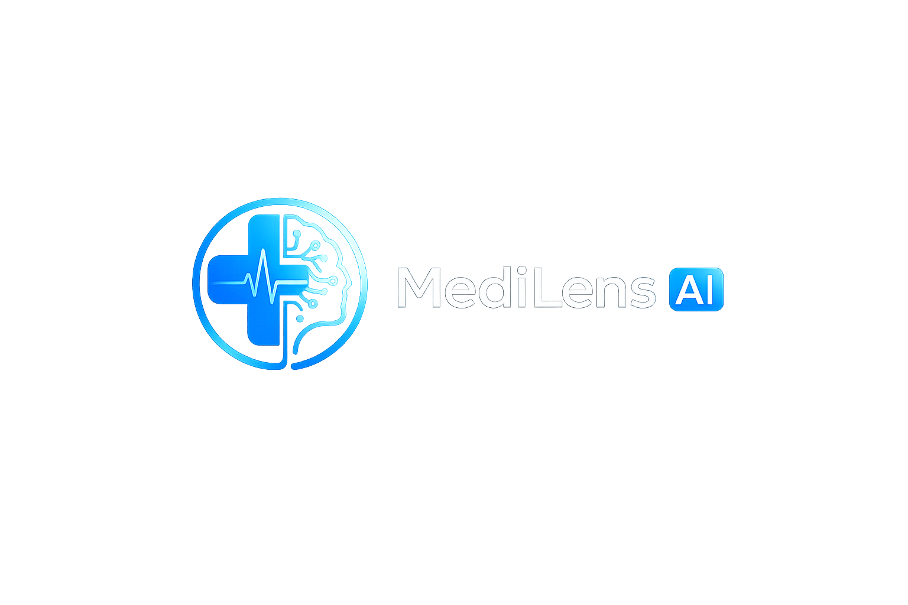

<div align="center">



# 🩺 MediLens AI

### AI-Powered Healthcare Assistant

An intelligent healthcare platform powered by **Machine Learning**, **Google Gemini AI**, and **Retrieval-Augmented Generation (RAG)**.

<p>


</p>

<p>


</p>

</div>

---

# 📖 Overview

**MediLens AI** is an AI-powered healthcare assistant designed to simplify medical report analysis and provide intelligent healthcare insights.

The application combines **Machine Learning**, **Google Gemini AI**, **LangChain**, and **FAISS Vector Database** to deliver personalized medical assistance through an interactive web interface.

Users can:

- 🩺 Predict diabetes risk using Machine Learning
- 📄 Analyze medical reports with AI
- 🤖 Generate intelligent medical summaries
- 💬 Ask questions about uploaded reports using an AI chatbot
- 📥 Download AI-generated report summaries

---

# ✨ Key Features

## 🩺 Disease Prediction

- Diabetes Risk Prediction
- Random Forest Machine Learning Model
- Prediction Confidence Score
- Personalized Health Recommendations

---

## 📄 Medical Report Analysis

- Upload Medical Reports (PDF)
- Automatic Text Extraction
- AI-Powered Medical Summary
- Download Summary as PDF

---

## 💬 AI Medical Chatbot

- Retrieval-Augmented Generation (RAG)
- Context-Aware Responses
- Personalized Medical Guidance
- FAISS Vector Search
- Google Gemini AI Integration

---

## 🎨 User Interface

- Modern Streamlit Dashboard
- Responsive Layout
- Interactive Components
- Dark Theme Support
- Clean Navigation

---

# 🛠 Tech Stack

| Category | Technologies |
|----------|--------------|
| Programming Language | Python |
| Frontend | Streamlit |
| Machine Learning | Scikit-learn |
| Generative AI | Google Gemini AI |
| RAG Framework | LangChain |
| Vector Database | FAISS |
| PDF Processing | PyMuPDF |
| PDF Generation | ReportLab |
| Data Processing | NumPy, Pandas |

---

# ⚙️ Project Workflow

```text
                Medical Report
                      │
                      ▼
              Upload PDF Report
                      │
                      ▼
             Extract Report Text
                      │
                      ▼
             Split Into Chunks
                      │
                      ▼
           Generate Embeddings
                      │
                      ▼
        Store in FAISS Vector Database
                      │
         ┌────────────┴────────────┐
         ▼                         ▼
 AI Medical Summary         Medical Chatbot
         │                         │
         └────────────┬────────────┘
                      ▼
          Personalized Healthcare Insights
```

---

# 📂 Project Structure

```text
MediLens-AI
│
├── ai/
│   └── gemini_helper.py
│
├── assets/
│   ├── logo.png
│   ├── age_distribution.png
│   ├── correlation_heatmap.png
│   └── outcome_distribution.png
│
├── data/
│   └── diabetes.csv
│
├── ml/
│   ├── trainer.py
│   ├── predictor.py
│   ├── preprocessing.py
│   └── evaluator.py
│
├── models/
│   ├── diabetes_model.pkl
│   └── scaler.pkl
│
├── pages/
│   ├── Home.py
│   ├── Disease_Prediction.py
│   ├── Report_Analysis.py
│   ├── Medical_Chatbot.py
│   └── About.py
│
├── rag/
│   ├── chatbot.py
│   ├── embeddings.py
│   ├── pdf_loader.py
│   ├── text_splitter.py
│   └── vector_store.py
│
├── reports/
├── utils/
│   ├── pdf_reader.py
│   └── pdf_generator.py
│
├── app.py
├── requirements.txt
└── README.md
```

---

# 📸 Application Screenshots

## 🏠 Home Page

> *(Add Screenshot)*

---

## 🩺 Disease Prediction

> *(Add Screenshot)*

---

## 📄 Medical Report Analysis

> *(Add Screenshot)*

---

## 💬 AI Medical Chatbot

> *(Add Screenshot)*

---

# 🚀 Installation

## Clone the Repository

```bash
git clone https://github.com/kshna11/MediLens-AI.git
```

Move to the project folder

```bash
cd MediLens-AI
```

Create Virtual Environment

```bash
python -m venv venv
```

Activate Virtual Environment

### Windows

```bash
venv\Scripts\activate
```

Install Dependencies

```bash
pip install -r requirements.txt
```

Create a `.env` file

```text
GEMINI_API_KEY=YOUR_GEMINI_API_KEY
```

Run the Application

```bash
streamlit run app.py
```

---

# 🌐 Live Demo

After deployment, add your Streamlit URL here.

```text
https://YOUR_STREAMLIT_APP_URL.streamlit.app
```

---

# 🔮 Future Scope

- Multi-Disease Prediction
- OCR Support for Scanned Reports
- Voice-Based Medical Assistant
- Medical Image Analysis
- User Authentication
- Cloud Database Integration
- Appointment Recommendation System
- Mobile Application

---

# 👨‍💻 Developer

## Krishna Jaiswal

**B.Tech – Data Science**

### Skills

- Python
- Machine Learning
- Generative AI
- LangChain
- FAISS
- Streamlit
- Scikit-learn

---

# 📜 License

This project is developed for **educational and learning purposes**.

Feel free to fork and improve the project.

---

# ⚠️ Disclaimer

This application provides AI-generated medical insights for informational and educational purposes only.

It should **NOT** be considered a substitute for professional medical advice, diagnosis, or treatment.

Always consult a qualified healthcare professional before making any medical decisions.

---

<div align="center">

### ⭐ If you found this project useful, please consider giving it a Star!

Made with ❤️ by **Krishna Jaiswal**

</div>